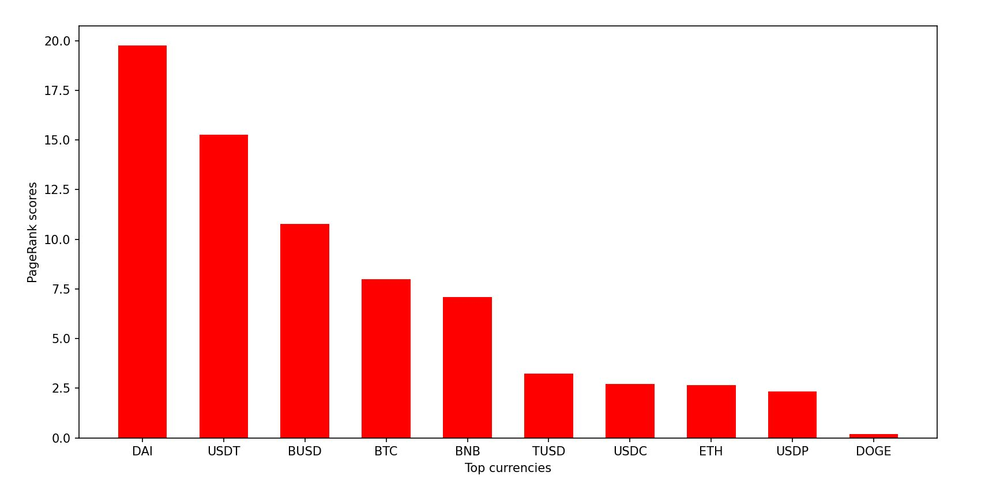

# Crypto_Analytics
Analysis of top cryptocurrencies using graph alogorithms

This project uses Python and Neo4j to get data from APIs from different websites on cryptocurrency markets and stores this information in a graph database using Neo4j.

Information on top 100 currencies from Coinmarketcap:

Currencies stored as vertices with information on trading pairs stored as relationships with respective properties:

Using Neo4j and its Python Driver the Python script runs the in Neo4j implemented PageRank Algorithm to give cryptocurrencies respective scores.

