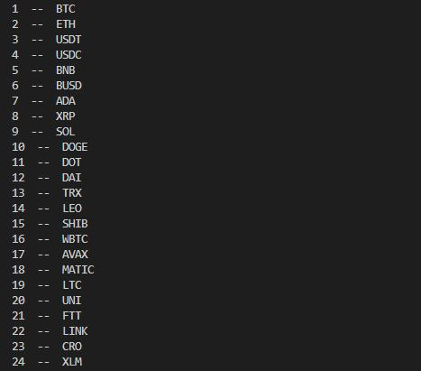
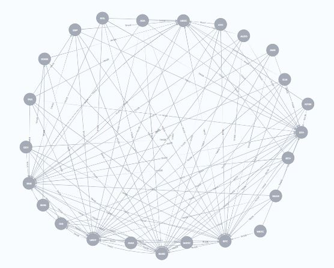
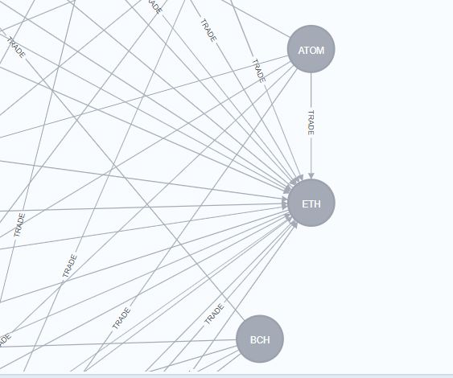
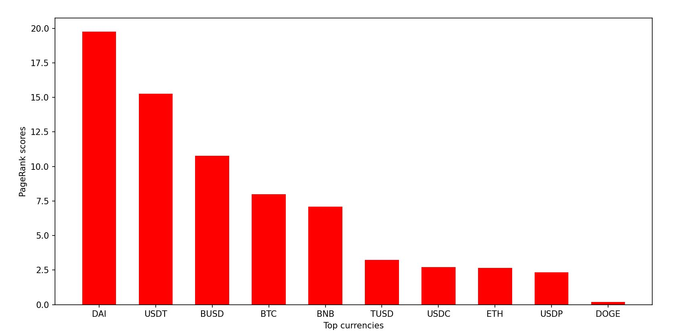

# Crypto_Analytics
Analysis of top cryptocurrencies using graph alogorithms

This project makes use of Neo4j in conjunction with Python to get data from APIs from different websites on cryptocurrency markets and then this information is stored in a graph database using Neo4j. The connection between cyrpotcurrency pairings given in form of the trades associated with the respective pairing gives rise to the graph structure. The data will be stored as a property graph using the popular graph database management system Neo4j.

## Input:

Information on rankings of the top 100 currencies drawn from API of a popular cryptocurrency market website:

## Methodology:

Information on currencies is stored as nodes in the graph database with information on trading pairs stored as relationships with respective properties outlining trade information.

Using Neo4j and its Python Driver the Python script runs the in Neo4j implemented PageRank Algorithm to give cryptocurrencies respective scores. These reflect the popularity of certain currencies with repect to data on trades between the given currencty and others.

## Output:

PageRank score of top cryptocurrencies plotted as bar graph indicating market trends.

